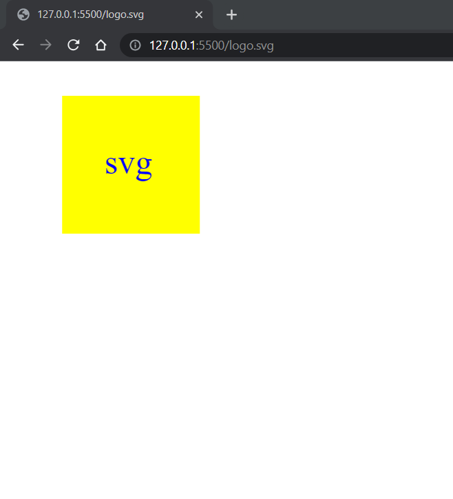
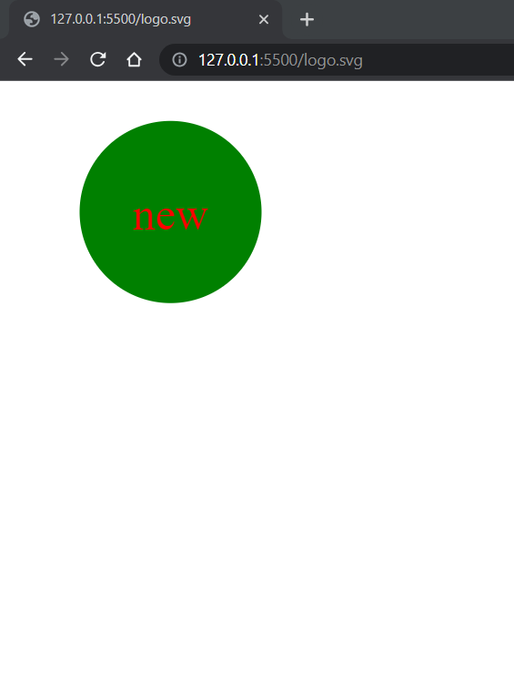
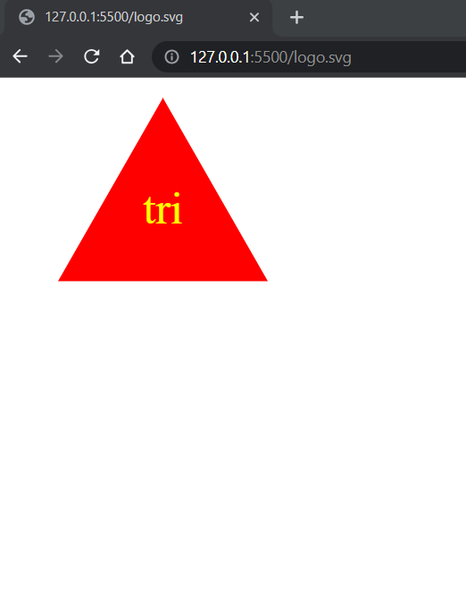

# SVG generator

## User Story
AS a freelance web developer
I WANT to generate a simple logo for my projects
SO THAT I don't have to pay a graphic designer

## Description
 SVG generator starts from command-line application that accepts user input. User starts answer for questions and enter information in terminal prompt mode, as a text color, shape of logo, shape and shape color This information is added to the sections. In the end svg file has been created and user can open the `logo.svg` file in a browser.  

## Github reference
https://github.com/secretariuss/svg-generator

## Video reference
https://drive.google.com/file/d/1J9KUJMYpGvnEW2KhM0OwYc_a7cvNl7jm/view

## Screen shots

The following scrshots shows the web application's:

## Acceptance Criteria
GIVEN a command-line application that accepts user input
WHEN I am prompted for text
THEN I can enter up to three characters
WHEN I am prompted for the text color
THEN I can enter a color keyword (OR a hexadecimal number)
WHEN I am prompted for a shape
THEN I am presented with a list of shapes to choose from: circle, triangle, and square
WHEN I am prompted for the shape's color
THEN I can enter a color keyword (OR a hexadecimal number)
WHEN I have entered input for all the prompts
THEN an SVG file is created named `logo.svg`
AND the output text "Generated logo.svg" is printed in the command line
WHEN I open the `logo.svg` file in a browser
THEN I am shown a 300x200 pixel image that matches the criteria I entered

  ## Table of Contents
  * [Installation](#installation)
  * [Usage](#usage)
  * [How to Contribute](#how-to-contribute)
  * [Tests](#tests)
  * [Questions?](#questions)
  
  ## Installation
  run in terminal node index.js
  ## Usage
  Use in the terminal, clone from github, run npm install
  ## How to Contribute
  [Contributor Covenant](https://www.contributor-covenant.org/)  
  In contributor covenant
  ## Tests
  run npm run test in terminal
  ## Questions?
  ### Reach me here: 
  [secretariuss](https://github.com/secretariuss)  
  secretarius@ukr.net